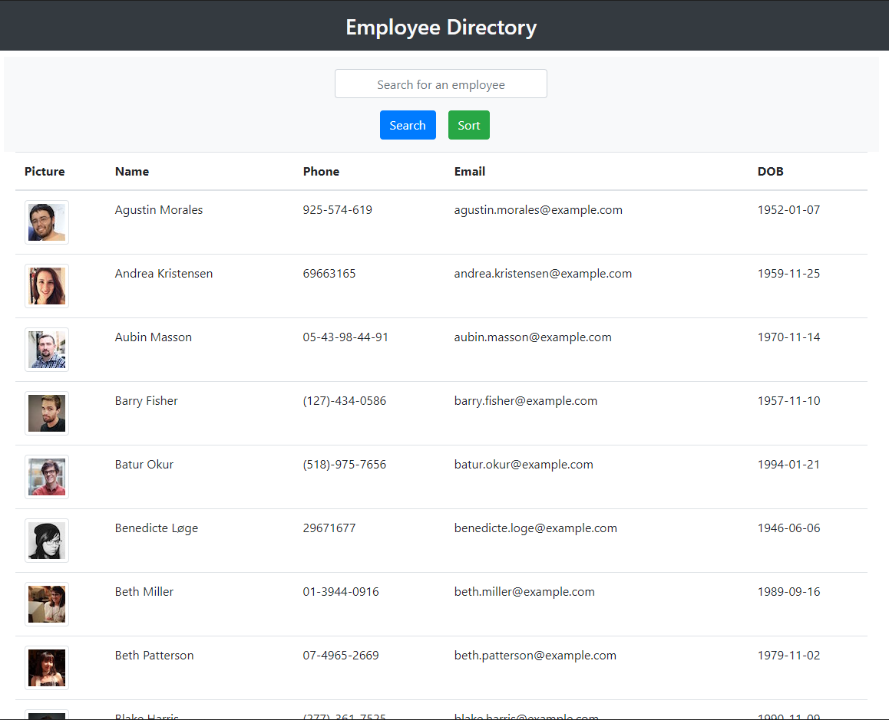

# Employee Directory


 - ### GitHub Link: https://github.com/greysonkirk/EmployeeDirectory
 - ### Heroku Link: https://safe-bastion-44814.herokuapp.com/


 This is a React.js app that displays a list of employees. The user can filter and sort the list of employees. 
 
Here is a code sample of the useEffect to bring in and set the employee state. 

 ```js
 useEffect(() => {
    API.getEmployees()
      .then((res) => {
        setEmployees(res.data.results);
        setFilterEmp(res.data.results);
      })
      .catch((err) => console.log(err));
  }, []);
```




